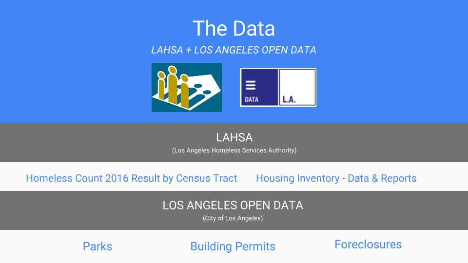
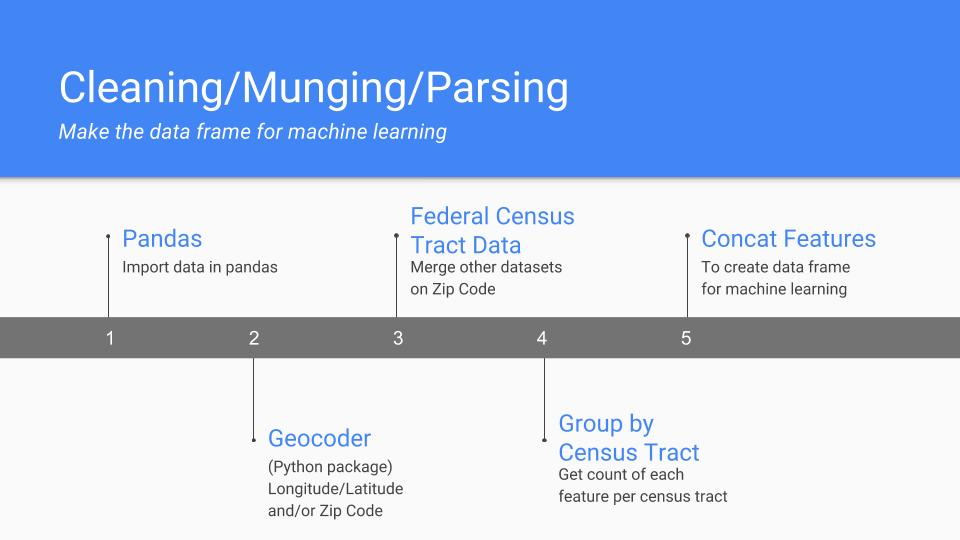
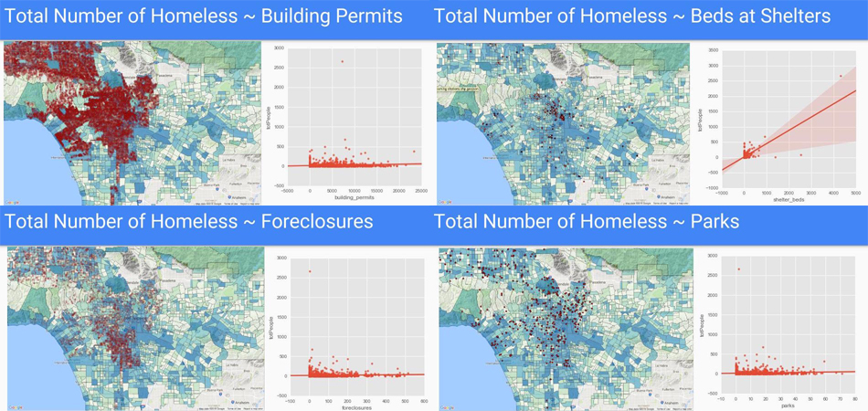
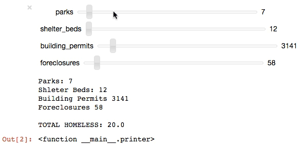

# Los Angeles Homelessness

During my immersive program at General Assembly, I started attending civic hack nights at Hack for LA where I joined the “Homeless Data LA” team. My General Assembly capstone project was to visualize homelessness and explore correlations between homelessness and open data sets that could lead to predictors of homelessness.  

### Data Sources
---

I used data from Los Angeles Homeless Services Authority (LAHSA):  

- [Homeless County 2016 Result by Census Tract](https://www.lahsa.org/homeless-count/reports#collapseThree2016)  
Approximately 7,500 volunteers counted the homeless in Los Angeles County per census tract, over three days.
- [Housing Inventory - Data & Reports](https://www.lahsa.org/homeless-count/housing-inventory/reports)  
LAHSA provides a comprehensive list of shelters in Los Angeles, which includes the total number of beds at each shelter.

I pulled data from the Los Angeles Open Data portal:

-  [Parks](https://data.lacity.org/A-Livable-and-Sustainable-City/Department-of-Recreation-and-Parks-Facility-and-Pa/ax8j-dhzm)  
Filtered down to 'LocationType' in the dataset to Beaches, Camps, Open Spaces, Parks, and Universally Accessible Playgrounds.  
- [Building Permits](https://data.lacity.org/A-Prosperous-City/Building-Permits/nbyu-2ha9)  
I filtered down all building permits that occured during the 2015 homeless count and the 2016 homeless count.
- [Foreclosures](https://data.lacity.org/A-Well-Run-City/2016-Registered-Foreclosure-Properties/hbin-6gap)   
Again, I filtered down all building permits that occured during the 2015 homeless count and the 2016 homeless count.  

### Cleaning / Munging / Parsing
---
  

1. Using Python, I began by importing all data into Pandas dataframes.  
2. The Python package geocoder was used to obtain zip codes and/or longitude/latitude   
3. The federal census tract data and joined on zip codes to get the census tract for each new building permit and foreclosure. 
4. Once I had a census tract for each record within all of my features (parks, building permits, and foreclosures), I performed a groupby on the 'census_tract' to get a count of the number of occurences for each census tract, then saved each to a new variable.
5. I then concatenated each feature (parks, building permits, and foreclosures) together on the 'census_tract' to make one dataframe with the total number homeless and count of each feature (parks, building permits, and foreclosures) in each census tract.

### Results
---
  
Analyzing each feature visually and statistically, for each census tract, against the total number of homeless people. The basemap in each graphic is has the total number of homeless per each census tract, the darker the census tract, the more homeless there are in each census tract. *We can see the strongest correlation between the number of beds  at each shelter*, however this may be a causation, depending on when the shelter was built. If the homeless count were performed more often, monthly, instead of yearly, I would have been able to determine if this is indeed a correlation. So we can say more confidently, **If we build a homeless shelter in a census tract, we can reasonbly expect the number of homeless in that census tract to increase**.

### Predictions
---
  

Using sci-kit learn, I used a linear regression model for its speed in interacting with the slider. The predictions are based on the number of each feature in each census tract to predict the total number of homelessness in each census tract.  

### Next Steps
---
- Identify new datasets to “feed” into model
- Use other regression models, ex: Random Forest Regressor, SVR, etc...
- Look into specific groups in the homeless count

### Tools used
---
- Analysis: Python (Pandas, NumPy, geocoder, seaborn, and scikit-learn)   
- Visualization: Tableau and QGIS  